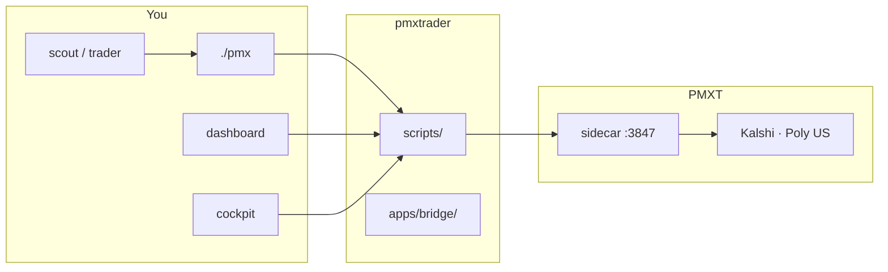
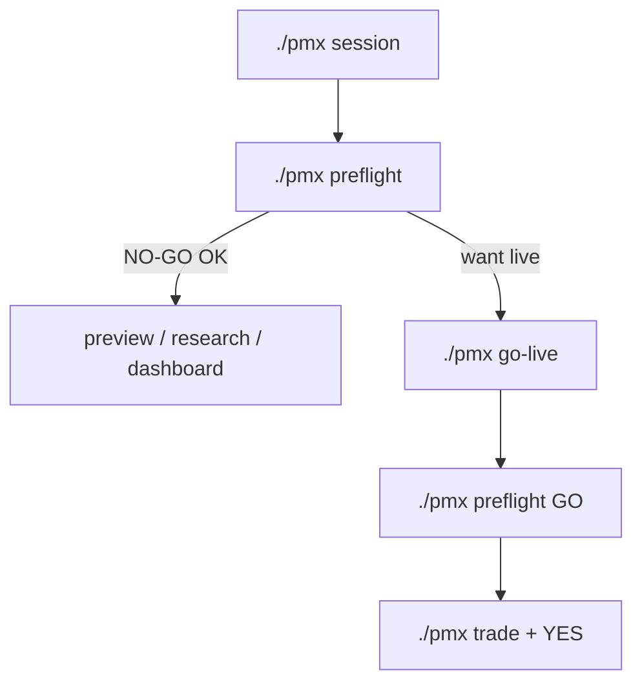
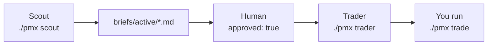

# pmxtrader

[](https://github.com/AbsCodeX/pmxtrader/actions/workflows/ci.yml)
[](https://github.com/AbsCodeX/pmxtrader/actions/workflows/docs-publish.yml)

Prediction market trading with **PMXT**, plain-language **`./pmx`** commands, and human-gated Scout/Trader agents.

> **Browse docs:** [abscodex.github.io/pmxtrader](https://abscodex.github.io/pmxtrader/) · **Repo map:** [`docs/README.md`](docs/README.md)

---

## What this is

| Layer | Role |
|-------|------|
| **pmxtrader** | CLI, dashboard, cockpit, agents, safety guards |
| **PMXT** (`pmxt/`) | Sidecar + exchange adapters (Kalshi, Polymarket US, …) |
| **Venues** | Real-money APIs when you `./pmx go-live` |

Supported shortcuts today: **Kalshi** (`./pmx`) and **Polymarket US** (`./pmx poly`).



---

## Three ways to use it

| Surface | Command | Best for | Live orders? |
|---------|---------|----------|--------------|
| **Terminal** | `./pmx …` | Trading, scripts, agents | Yes (after go-live) |
| **Web** | `./pmx dashboard` | Link analyze, command center | **No** |
| **Cockpit** | `./pmx cockpit` | Live tiles, safety tab | Yes (with confirm) |

Secrets stay in **`pmxt/.env`** — never committed.

---

## Quick start

### 1 — One-time setup

```bash
git submodule update --init     # optional: pmxt-mcp, molt-pmxt
./scripts/setup-dev.sh          # build PMXT, install CLI
# copy pmxt/.env.example → pmxt/.env and add keys (see table below)
./scripts/setup-direnv.sh       # optional: pmx from anywhere
```

### 2 — Every session (safe by default)

```bash
source scripts/pmxt-env.sh      # or: direnv allow
./pmx session                   # sidecar + read-only ON
./pmx preflight                 # GO/NO-GO checklist
```

| Preflight result | Meaning |
|------------------|---------|
| **NO-GO** + read-only FAIL | **Expected** — safe default |
| **GO** | Ready for live (after `./pmx go-live`) |

### 3 — Practice without live orders

```bash
./pmx preview trade MARKET OUT 1
./pmx preview poly trade SLUG long 1
./pmx panic --dry-run
./pmx dashboard
```

### 4 — Live trading (when intentional)

```bash
./pmx go-live                   # clears read-only + kill switch
./pmx preflight                 # must show GO
./pmx preview trade …           # optional dry-run first
./pmx trade MARKET OUT 1        # type YES at prompt
```



---

## Credentials (`pmxt/.env`)

| Venue | Variables | Setup |
|-------|-----------|-------|
| Kalshi | `KALSHI_API_KEY`, `KALSHI_PRIVATE_KEY` | [`pmxt/core/docs/SETUP_KALSHI.md`](pmxt/core/docs/SETUP_KALSHI.md) |
| Polymarket US | `POLYMARKET_US_KEY_ID`, `POLYMARKET_US_SECRET_KEY` | [`pmxt/core/docs/SETUP_POLYMARKET_US.md`](pmxt/core/docs/SETUP_POLYMARKET_US.md) |
| LLM agents | `XAI_*`, `ANTHROPIC_*`, `OPENAI_*` | [`docs/providers.md`](docs/providers.md) |
| Safety (auto-set) | `PMX_READ_ONLY`, `PMX_MAX_TRADE_CONTRACTS` | [`docs/environment.md`](docs/environment.md) |

After editing `.env`: `./pmx warm`

---

## Daily commands

| Goal | Kalshi | Polymarket US |
|------|--------|---------------|
| Balance | `./pmx balance` | `./pmx poly balance` |
| Quote | `./pmx quote EVENT OUT` | `./pmx poly quote SLUG long` |
| Analyze URL | `./pmx link URL OUT 1` | `./pmx poly link URL long` |
| Trade | `./pmx trade MKT OUT 1` | `./pmx poly trade SLUG long 1` |
| Dry-run | `./pmx preview trade …` | `./pmx preview poly trade …` |

Full reference: [`docs/commands.md`](docs/commands.md)

---

## Multi-agent workflow

Research and execution stay separate. **You** approve every live order.



```bash
./scripts/setup-hermes.sh
./scripts/new-brief.sh my-market
./pmx scout grok
# edit brief: approved: true
./pmx trader openai briefs/active/DATE-my-market.md
# you run ./pmx trade or ./pmx poly trade
```

Details: [`docs/multi-agent.md`](docs/multi-agent.md)

---

## Safety (short list)

| Control | Command / default |
|---------|-------------------|
| Pre-live check | `./pmx preflight` |
| Read-only default | ON until `./pmx go-live` |
| Max size | 10 contracts (`PMX_MAX_TRADE_CONTRACTS`) |
| Kill switch | `./pmx stop on "reason"` |
| Panic flatten | `./pmx panic` (Kalshi + Poly US) |
| Preview panic | `./pmx panic --dry-run` |
| Env dry-run | `PMX_DRY_RUN=1` or `--dry-run` on trade scripts |
| Trade confirm | Type **YES** (or `--yes`) |

Web dashboard **cannot** place live orders. Full risks: [`docs/known-risks.md`](docs/known-risks.md)

---

## Project layout

| Path | What |
|------|------|
| `pmx`, `scripts/` | CLI entry points |
| `apps/bridge/` | Shared Python (safety, parse) |
| `apps/cockpit/` | Textual TUI |
| `dashboard/` | Web UI (not `apps/dashboard/`) |
| `pmxt/` | PMXT engine |
| `config/` | Agent policy (no secrets) |
| `docs/` | Guides — **[index](docs/README.md)** |
| `tests/` | Python tests (114+) |

Diagram: [`docs/project-structure.md`](docs/project-structure.md)

---

## Testing

```bash
.venv-cockpit/bin/python -m pytest tests/ -q
./scripts/smoke-functionality.sh
```

Details: [`docs/testing.md`](docs/testing.md) · [`docs/official-links.md`](docs/official-links.md) · Reports: [`LIVE_READINESS_REPORT.md`](LIVE_READINESS_REPORT.md), [`DRY_RUN_TEST_REPORT.md`](DRY_RUN_TEST_REPORT.md)

---

## License

MIT
