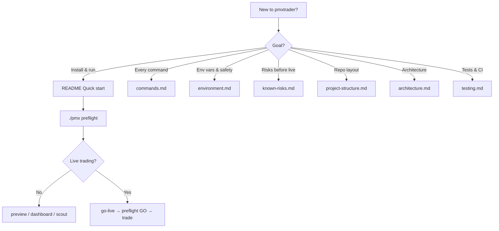
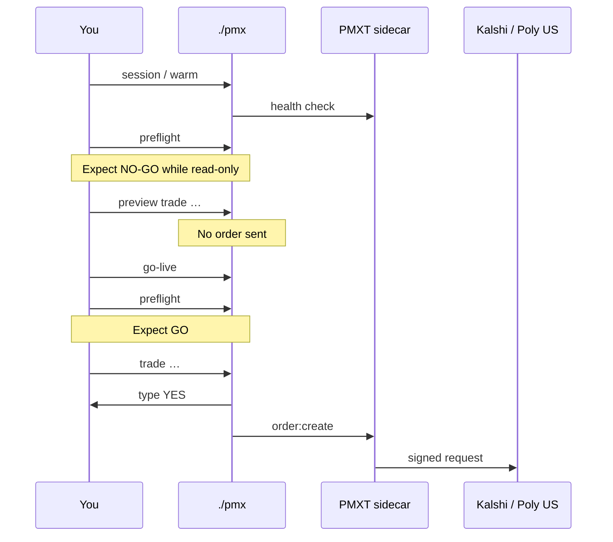
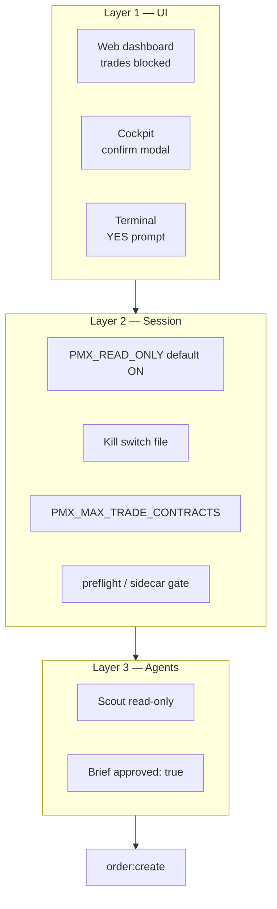

# Documentation index

**Published site:** [abscodex.github.io/pmxtrader](https://abscodex.github.io/pmxtrader/) (MkDocs Material)

**Local preview:** `pip install -r requirements-docs.txt && ./scripts/docs-serve.sh` → [http://127.0.0.1:8000](http://127.0.0.1:8000)

**Start here** if you need to review, visualize, or look up how pmxtrader fits together.

---

## At a glance

| What | Where | Can place live orders? |
|------|-------|------------------------|
| **Terminal CLI** | `./pmx` | Yes — after `./pmx go-live` + YES confirm |
| **Web dashboard** | `./pmx dashboard` → `dashboard/` | **No** — copy commands to Terminal |
| **Cockpit TUI** | `./pmx cockpit` | Yes — confirm modal required |
| **Scout agent** | `./pmx scout` | **No** — research only |
| **Trader agent** | `./pmx trader` | Prepares commands; human executes |
| **PMXT engine** | `pmxt/` sidecar `:3847` | Used by all of the above |
| **Secrets** | `pmxt/.env` only | Never commit |

---

## Choose your path

---

## By audience

### Operator (trading session)

| Doc | Use when |
|-----|----------|
| [commands.md](commands.md) | Full `./pmx` reference |
| [environment.md](environment.md) | Env vars, defaults, go-live |
| [known-risks.md](known-risks.md) | Before real money |
| [kalshi-integration.md](kalshi-integration.md) | Kalshi URLs, panic, demo |
| [polymarket-us-integration.md](polymarket-us-integration.md) | Poly US, `./pmx poly` |
| [cockpit.md](cockpit.md) | Textual TUI |
| [multi-agent.md](multi-agent.md) | Scout / Trader workflow |
| [providers.md](providers.md) | LLM keys and routing |

### Developer (code & CI)

| Doc | Use when |
|-----|----------|
| [project-structure.md](project-structure.md) | Folders and entry points |
| [architecture.md](architecture.md) | Request flow, security layers |
| [testing.md](testing.md) | pytest, smoke, lint |
| [dependencies.md](dependencies.md) | npm/pip inventory |
| [AGENTS.md](https://github.com/AbsCodeX/pmxtrader/blob/main/AGENTS.md) | Cursor Cloud, PMXT build |
| [hermes/README.md](https://github.com/AbsCodeX/pmxtrader/blob/main/hermes/README.md) | Hermes bundles, MCP policy |

### Audit & readiness

| Doc | Use when |
|-----|----------|
| [Live readiness](reports/live-readiness.md) | Go / No-Go checklist |
| [Dry-run test](reports/dry-run-test.md) | Dry-run verification |
| [Batch audit mirrors](https://github.com/AbsCodeX/pmxtrader/tree/main/reviews/2026-06-19) | Review folder on GitHub |
| [official-links.md](official-links.md) | PMXT, venue, API URLs |

---

## Live session flow (reference)

---

## Safety layers (reference)

Details: [known-risks.md](known-risks.md) · [trading-safety review](https://github.com/AbsCodeX/pmxtrader/blob/main/reviews/2026-06-19/trading-safety-review.md)

---

## Config vs secrets

| Location | Contains | In git? |
|----------|----------|---------|
| `pmxt/.env` | API keys, LLM keys | **No** |
| `config/agents.json` | Scout/Trader policy | Yes |
| `config/providers.json` | Model defaults | Yes |
| `KILL_SWITCH` | Halt sentinel file | **No** |
| `.pmx-live` | Go-live marker | **No** |
| `briefs/active/` | Trade briefs | **No** |

---

## Venues supported by `./pmx`

| Venue | CLI prefix | Demo / paper? |
|-------|------------|---------------|
| **Kalshi** | `./pmx` (default) | `./scripts/kalshi-demo-quickstart.sh` |
| **Polymarket US** | `./pmx poly` | Preview/dry-run only (no retail demo) |

International Polymarket and other PMXT exchanges live in `pmxt/` but are not wired to `./pmx` shortcuts.
