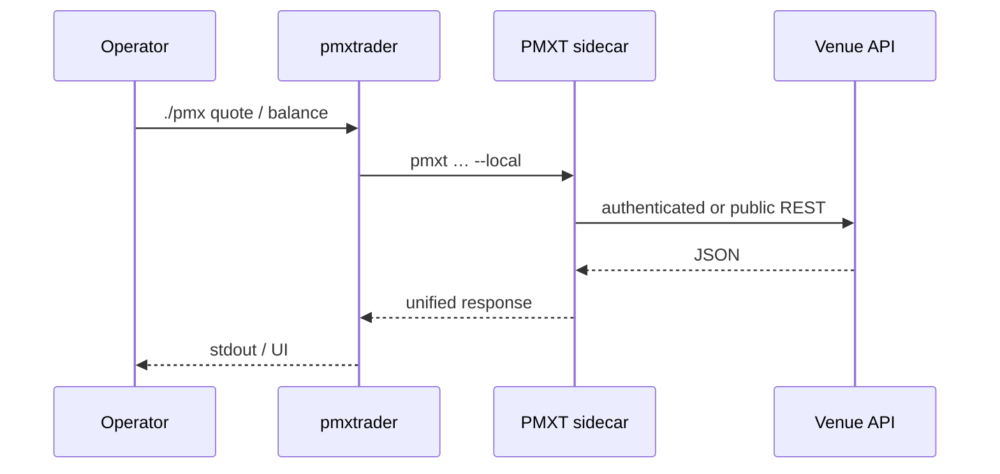
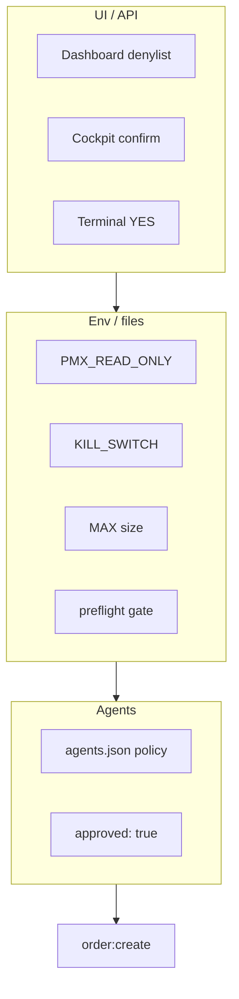

# Architecture

## Overview

`pmxtrader` orchestrates prediction market workflows around **PMXT**. Terminal (`./pmx`), web dashboard, Textual cockpit, and Hermes agents all share one chain:

**UI → scripts → PMXT CLI → local sidecar → venue APIs**

Full directory map: [`docs/project-structure.md`](project-structure.md) · Visual index: [`docs/README.md`](README.md)

---

## System diagram

```mermaid
flowchart TB
  subgraph Entry["Entry points"]
    PMX[./pmx]
    DASH[dashboard/]
    COCK[apps/cockpit/]
    AGENT[agent-run.sh]
  end
  subgraph Orchestration["pmxtrader"]
    SH[scripts/]
    BR[apps/bridge/]
  end
  subgraph Engine["PMXT pmxt/"]
    CLI[@pmxt/cli]
    SC[sidecar HTTP]
    EX[kalshi · polymarket_us]
  end
  subgraph External["Venues"]
    K[Kalshi API]
    P[Polymarket US API]
  end
  PMX --> SH
  DASH --> SH
  COCK --> BR --> SH
  AGENT --> SH
  SH --> BR
  SH --> CLI --> SC --> EX
  EX --> K
  EX --> P
```

---

## Request flow (typical read)



Live **trade** adds guards in `apps/bridge/trade_safety.py` before `order:create`.

---

## Layer responsibilities

| Layer | Location | Responsibility |
|-------|----------|------------------|
| **UI** | `dashboard/`, `apps/cockpit/` | Presentation; browser has no keys |
| **Bridge** | `apps/bridge/` | Command policy, parse, trade guards, dashboard security |
| **Cockpit adapter** | `apps/cockpit/bridge/` | TUI subprocess wrappers |
| **Shell** | `scripts/` | CLI router, quickstarts, kill switch, dashboard server |
| **Engine** | `pmxt/` | Sidecar, exchange adapters, `@pmxt/cli` |
| **Secrets** | `pmxt/.env` | Venue + LLM keys only |

---

## Key principles

| Principle | Implementation |
|-----------|----------------|
| PMXT as core | All venue I/O via sidecar |
| Secrets isolated | `pmxt/.env` only; policy in `config/` |
| UI does not trade (web) | Dashboard allowlist blocks `trade` |
| Human gate | Read-only default, YES confirm, brief approval |
| Modular | `apps/bridge` shared; cockpit adapter thin |

---

## Safety architecture



See [`known-risks.md`](known-risks.md) · [trading-safety review](https://github.com/AbsCodeX/pmxtrader/blob/main/reviews/2026-06-19/trading-safety-review.md)

---

## Technology stack

| Area | Stack |
|------|-------|
| pmxtrader app | Python, Bash, HTML/CSS/JS |
| PMXT engine | TypeScript/npm in `pmxt/` |
| CI | GitHub Actions — pytest, ruff, mypy, secret scan |

---

## Network transparency

| Integration | How you observe it |
|-------------|-------------------|
| `./pmx` | CLI stdout/stderr |
| Sidecar | Verbose header → sidecar logs |
| Dashboard / cockpit | Subprocess output in UI |
| Prediction Hunt | `ph-sports-compare.sh` (curl) |
| Hermes / LLM | Opaque; stderr only |
| Panic flatten | Direct venue REST in emergency scripts |

Subprocess env: `minimal_subprocess_env()` in `apps/bridge/dashboard_security.py`.

---

## Audit trail

| Review | Document |
|--------|----------|
| Cockpit / scripts / dashboard | [cockpit-scripts-dashboard review](https://github.com/AbsCodeX/pmxtrader/blob/main/reviews/2026-06-19/cockpit-scripts-dashboard-review.md) |
| API integration | [api-integration review](https://github.com/AbsCodeX/pmxtrader/blob/main/reviews/2026-06-19/api-integration-review.md) |
| Dependencies | [`dependencies.md`](dependencies.md) |
| UI / dashboard | [ui-dashboard review](https://github.com/AbsCodeX/pmxtrader/blob/main/reviews/2026-06-19/ui-dashboard-review.md) |
| Functionality | [functionality review](https://github.com/AbsCodeX/pmxtrader/blob/main/reviews/2026-06-19/functionality-review.md) |
| Trading safety | [trading-safety review](https://github.com/AbsCodeX/pmxtrader/blob/main/reviews/2026-06-19/trading-safety-review.md) |
| Project structure | [project-structure review](https://github.com/AbsCodeX/pmxtrader/blob/main/reviews/2026-06-19/project-structure-review.md) |
| Documentation | [documentation review](https://github.com/AbsCodeX/pmxtrader/blob/main/reviews/2026-06-19/documentation-review.md) |
| Live readiness | [Live readiness report](reports/live-readiness.md) |
