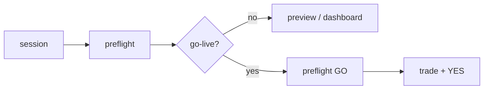

# pmxtrader command reference

Plain-language shortcuts via `./pmx` (`scripts/pmx.sh`). Run from repo root.

> **Visual index:** [`docs/README.md`](README.md) · **Live flow:** preflight → go-live → preview → trade

---

## On this page

| Section | Jump to |
|---------|---------|
| Agent routing | [Which tool to use](#which-tool-to-use-agents) |
| Kalshi | [Kalshi commands](#kalshi-default-pmx-balance) |
| Polymarket US | [Poly commands](#polymarket-us-pmx-poly) |
| Session | [Start a session](#start-a-session) |
| Safety | [Safety & agents](#safety-agents) |
| Hermes | [Hermes bundles](#hermes-bundles) |

---

## Session modes

| Mode | How | Live trades? |
|------|-----|--------------|
| **Safe default** | `./pmx session` | No — read-only ON |
| **Preview** | `./pmx preview trade …` | No — dry-run text |
| **Live** | `./pmx go-live` then `./pmx trade …` | Yes — YES confirm |

**Sidecar:** credentials in `pmxt/.env` — restart with `./pmx warm` after edits.

**Real money:** Kalshi + Polymarket US when live. Kill switch blocks `./pmx trade`, `./pmx poly trade|sell|close`.

---

## Project map (for agents)

| Path | Purpose |
|------|---------|
| `./pmx` | Main CLI shortcuts (Kalshi, Poly US, agents) |
| `pmxt/` | PMXT engine + `pmxt/.env` credentials |
| `scripts/` | Shell/Python tooling (`pmxt-server.sh`, `kill-switch.sh`, agents) |
| `briefs/active/` | Trade briefs (Scout writes, human approves) |
| `config/agents.json` | Scout/Trader roles and allowed tools |
| `config/providers.json` | LLM model defaults |
| `hermes/skills/` | Hermes agent skills (linked by `setup-hermes.sh`) |
| `docs/` | Integration guides (this file, multi-agent, providers) |

---

## Which tool to use (agents)

| Goal | Tool | Command |
|------|------|---------|
| Kalshi URL → analysis | Terminal | `./pmx link URL OUTCOME [size]` |
| Kalshi quote / eval | Terminal | `./pmx quote EVENT OUTCOME [size]` |
| Poly US URL → quote | Terminal | `./pmx poly link URL long` |
| Poly US quote | Terminal | `./pmx poly quote SLUG long` |
| Cross-venue odds (pre-trade) | Terminal | `./pmx compare url URL` |
| Poly US API docs lookup | **MCP** `polymarket_us_docs` | Scout only — read-only |
| Multi-venue market search | PMXT MCP | Claude/Codex only (`--with-mcp`) — **not Grok** |
| Kalshi live order | Terminal | `./pmx trade MARKET OUTCOME [size]` |
| Poly US live order | Terminal | `./pmx poly trade\|sell\|close ...` |
| Live Kalshi book | Terminal | `./pmx watch OUTCOME_ID` |
| Live Poly US book | Terminal | `./pmx poly watch book SLUG long` |
| Account health | Terminal | `./pmx status` |

**Hermes default:** terminal `./pmx` only (`-t no_mcp`). PMXT trading MCP disabled for Grok compatibility.

---

## Kalshi (default `./pmx balance`)

| Command | Purpose |
|---------|---------|
| `./pmx balance` | Available cash |
| `./pmx positions` | Open holdings |
| `./pmx link URL [OUTCOME] [size]` | URL → full eval snapshot |
| `./pmx quote EVENT [OUTCOME] [size]` | Price + book + fill est |
| `./pmx event EVENT` | Raw event JSON |
| `./pmx trade MARKET OUTCOME [size]` | Market buy (kill switch OFF) |
| `./pmx watch OUTCOME` | Stream orderbook |
| `./pmx trades OUTCOME` | Public trade tape |
| `./pmx fills [OUTCOME]` | Your fill stream |
| `./pmx compare url URL` | Prediction Hunt cross-venue |
| `./pmx compare slate SPORT` | Sports slate compare |

Setup: `pmxt/core/docs/SETUP_KALSHI.md` · Map: `docs/kalshi-integration.md`

---

## Polymarket US (`./pmx poly`)

Retail keys: `POLYMARKET_US_KEY_ID` / `POLYMARKET_US_SECRET_KEY` in `pmxt/.env`.  
Get keys: [polymarket.us/developer](https://polymarket.us/developer)

| Command | Purpose |
|---------|---------|
| `./pmx poly balance` | US cash |
| `./pmx poly positions` | Open holdings |
| `./pmx poly markets [query]` | Search markets |
| `./pmx poly quote SLUG [long\|short]` | Market metadata + REST orderbook |
| `./pmx poly link URL [long\|short]` | Quote from polymarket.us URL |
| `./pmx poly trade SLUG [long\|short] [qty] [price]` | Market/limit **buy** |
| `./pmx poly sell SLUG [long\|short] [qty] [price]` | Market/limit **sell** |
| `./pmx poly close SLUG [long\|short] [qty]` | Market sell full position (or qty) |
| `./pmx poly watch book SLUG [long\|short]` | Live orderbook (active markets) |
| `./pmx poly watch trades SLUG [long\|short]` | Public trade tape |
| `./pmx poly history [SLUG] [--limit N]` | Your fill history |
| `./pmx poly orders` | Open orders |
| `./pmx poly cancel ORDER_ID` | Cancel one order |
| `./pmx poly cancel-all [SLUG]` | Cancel all open orders |

Side convention: `long` = YES side, `short` = NO side (outcome id `SLUG:long`).

Setup: `pmxt/core/docs/SETUP_POLYMARKET_US.md` · Integration: `docs/polymarket-us-integration.md`

**Not available** on retail keys: institutional gRPC streams, order modify/replace, order preview API.

---

## Start a session

| Command | Where | What |
|---------|-------|------|
| `pmxt-terminal` | Anywhere (after setup) | **New Terminal window** → sidecar + status + cheat sheet |
| `pmxt-start` | Inside repo (direnv) | Session bootstrap in **current** shell |
| `./pmx session` | Inside repo | Same as `pmxt-start` |
| `./pmx terminal` | Inside repo | Same as `pmxt-terminal` |
| `./pmx dashboard` | Inside repo | Browser command center + live mini-terminal |

Setup: `./scripts/setup-direnv.sh` · Dashboard: `./scripts/pmxt-dashboard.sh` · Offline: open `dashboard/index.html` (or root `index.html` redirect)

Does: ensure PMXT sidecar (loads `pmxt/.env`), warm Kalshi + Poly US balances, `./pmx status`, cheat sheet.

---

## Safety & agents {#safety-agents}

| Command | Purpose |
|---------|---------|
| `./pmx status` | Kill switch + panic scope + venue balances |
| `./pmx preflight` | Pre-live GO/NO-GO checklist (alias `./pmx check`) |
| `./pmx preview trade MKT OUT 1` | Dry-run Kalshi order (no execution) |
| `./pmx preview poly trade SLUG long 1` | Dry-run Poly US order |
| `./pmx warm` | Start/warm PMXT sidecar |
| `./pmx go-live` | Clear read-only + disengage kill switch |
| `./pmx stop on "reason"` | Block new trades |
| `./pmx resume` | Same as `./pmx go-live` |
| `./pmx stop orders` | Halt + cancel resting orders |
| `./pmx panic` | Halt + cancel + flatten (type PANIC) |
| `./pmx panic status` | Show which venues panic will flatten |
| `./pmx panic --dry-run` | Preview panic scope (alias `./pmx stop dry`) |
| `./pmx brief SLUG` | Create trade brief |
| `./pmx scout grok` | Scout agent (research) |
| `./pmx trader openai BRIEF.md` | Trader agent (approved brief only) |

---

## Hermes bundles

After `./scripts/setup-hermes.sh`:

| Bundle | Role | Skills |
|--------|------|--------|
| `/pmxtrader-scout` | Research, no orders | pmxtrader-scout, pmxtrader-commands, multi-agent-handoff |
| `/pmxtrader-trader` | Execute from approved brief | pmxtrader-trader, pmxtrader-commands, multi-agent-handoff |

Launch: `./pmx scout grok` or `hermes chat --cli -t no_mcp` then `/pmxtrader-scout`

See `hermes/README.md` · `docs/multi-agent.md` · `docs/providers.md`
