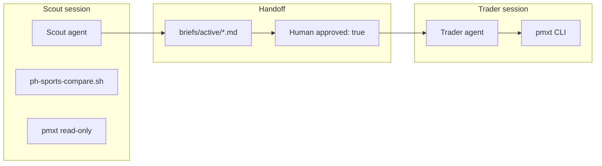

# Multi-agent system

pmxtrader splits **research** and **execution** so no single agent loads every MCP tool and slows down live trades.

## Architecture



## Roles

See `config/agents.json` and `apps/agents/README.md`.

## Provider matrix

| Provider | Scout | Trader | Notes |
|----------|-------|--------|-------|
| **Cursor** | ✅ recommended | ✅ recommended | Rules in `.cursor/rules/` |
| **Claude Code** | ✅ deep research | ⚠️ brief-only | `claude -p` via agent-run |
| **Codex** | ✅ structured | ✅ command prep | `codex exec` |
| **Hermes** | ✅ terminal CLI | ✅ terminal CLI | `./scripts/agent-run.sh scout hermes` (no MCP by default) |
| **OpenAI API** | ✅ cheap scans | ✅ command prep | `./pmx trader openai BRIEF.md` |
| **Grok/xAI** | ✅ fast scan | ❌ | `./pmx scout grok` (Hermes xAI or OAuth) |

Subscriptions and API credits map to:

- **Cursor Max/Pro** → `./pmx scout cursor` / `./pmx trader cursor`
- **Claude API** → `./pmx scout claude` (Sonnet via Hermes)
- **OpenAI API** → `./pmx trader openai BRIEF.md` (gpt-4o-mini default)
- **Codex** → `./scripts/agent-run.sh scout codex` / `trader codex`
- **Grok/xAI** → `./pmx scout grok` (OAuth or `XAI_API_KEY`)
- **Hermes default** → `./scripts/agent-run.sh scout hermes`

Add keys to `pmxt/.env`, run `./scripts/setup-hermes.sh`, verify with `./scripts/check-providers.sh`. Full routing: `docs/providers.md`.

## Daily workflow

```bash
source scripts/pmxt-env.sh
./scripts/new-brief.sh fed-june
./pmx scout grok
# Scout fills brief; you set approved: true
./pmx trader openai briefs/active/2026-06-19-fed-june.md
# You run the pmxt command shown
```

## What not to do

- One chat with pmxt-mcp + PH + Octagon + execution
- Trader re-running PH compare
- Auto `order:create` without human confirmation

## Future: Monitor role

PH WebSocket daemon → `briefs/alerts.json` → Scout reads alerts. See `apps/agents/monitor/README.md`.
