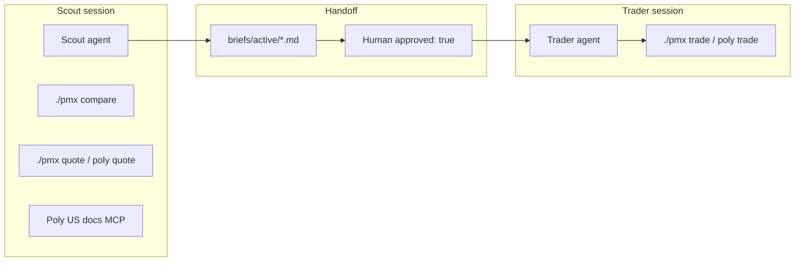

# Multi-agent system

pmxtrader splits **research** (Scout) from **execution** (Trader) so no single agent loads every tool and slows live trades.

## Architecture



## Roles

See `config/agents.json`, `apps/agents/README.md`, and **`docs/commands.md`** (tool routing).

| Role | Venues | Tools |
|------|--------|-------|
| **Scout** | Kalshi + Poly US research | `./pmx link`, `./pmx poly quote`, `./pmx compare`, Poly US docs MCP |
| **Trader** | Kalshi or Poly US from brief | `./pmx trade` or `./pmx poly trade/sell/close` |
| **Human** | Both | Approve brief, confirm every order |

## Hermes setup

```bash
./scripts/setup-hermes.sh
./scripts/install-hermes-skills.sh   # included in setup
```

Skills: `pmxtrader-scout`, `pmxtrader-trader`, `pmxtrader-commands`, `multi-agent-handoff`  
Bundles: `/pmxtrader-scout`, `/pmxtrader-trader`  
Policy: terminal `./pmx` only (`-t no_mcp`); Poly US docs MCP on; PMXT trading MCP off (Grok-safe)

See `hermes/README.md`

## Provider matrix

| Provider | Scout | Trader | Notes |
|----------|-------|--------|-------|
| **Grok/xAI** | ✅ fast scan | ❌ | `./pmx scout grok` |
| **Claude API** | ✅ deep research | ⚠️ brief-only | `./pmx scout claude` |
| **OpenAI API** | ✅ cheap scans | ✅ command prep | `./pmx trader openai BRIEF.md` |
| **Cursor** | ✅ rules + skills | ✅ | `./pmx scout cursor` |
| **Hermes** | ✅ terminal CLI | ✅ terminal CLI | `./scripts/agent-run.sh scout hermes` |

Keys in `pmxt/.env` → `./scripts/setup-hermes.sh` → `./scripts/check-providers.sh`  
Full routing: `docs/providers.md`

## Daily workflow

```bash
source scripts/pmxt-env.sh
./scripts/new-brief.sh fed-june
./pmx scout grok
# Scout fills brief; set approved: true and venue (Kalshi or Polymarket US)
./pmx trader openai briefs/active/2026-06-19-fed-june.md
# Human confirms and runs ./pmx trade or ./pmx poly trade
```

## What not to do

- One chat with PMXT MCP + PH + execution (use separate Scout/Trader sessions)
- Trader re-running `./pmx compare` or Poly US docs MCP
- Auto `./pmx trade` or `./pmx poly trade` without human confirmation

## Future: Monitor role

PH WebSocket daemon → `briefs/alerts.json` → Scout reads alerts. See `apps/agents/monitor/README.md`.
