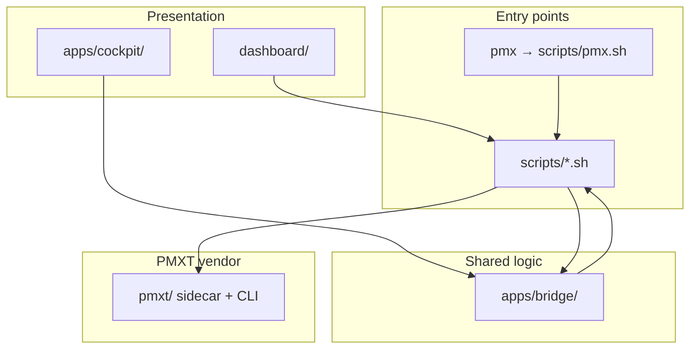

<div class="pmx-page-hero" markdown="1">

# Project structure

<p class="pmx-page-lead">
pmxtrader is a thin orchestration layer around vendored <code>pmxt/</code>. Application code lives under
<code>apps/</code>, <code>dashboard/</code>, and <code>scripts/</code>.
</p>

</div>

## Layer diagram



---

## Directory tree

```text
pmxtrader/
├── pmx                     # CLI shim → scripts/pmx.sh
├── apps/
│   ├── bridge/             # Shared Python: commands, parse, trade_safety, security
│   ├── cockpit/            # Textual TUI + cockpit/bridge adapter
│   └── agents/             # Scout / Trader / Monitor prompts
├── dashboard/              # Web command center — NOT apps/dashboard/
├── scripts/                # Shell entry points, servers, quickstarts
├── config/                 # agents.json, providers.json (no secrets)
├── docs/                   # Guides — start at docs/README.md
├── tests/                  # Python tests
├── reviews/                # Audit mirrors
├── briefs/                 # Trade briefs (active/ gitignored)
├── hermes/                 # Hermes skill mirrors
├── pmxt/                   # Vendored PMXT monorepo
├── pmxt-mcp/               # Git submodule (optional)
├── molt-pmxt/              # Git submodule (optional)
├── packages/               # Reserved scaffold
└── tools/                  # Reserved scaffold
```

---

## Entry points

| Command | Resolves to | Purpose |
|---------|-------------|---------|
| `./pmx …` | `scripts/pmx.sh` | CLI router |
| `./pmx cockpit` | `pmxt-cockpit.sh` → `python -m apps.cockpit` | Textual TUI |
| `./pmx dashboard` | `pmxt-dashboard.sh` → `pmxt-dashboard-server.py` | Web UI |
| `./pmx scout\|trader` | `agent-run.sh` | Hermes agents |
| `./pmx preflight` | `pmx-preflight.sh` | GO/NO-GO checklist |
| Sidecar | `pmxt-server.sh` | PMXT HTTP `:3847` |
| Kill switch | `kill-switch.sh` | `KILL_SWITCH` file |

Offline bookmark: root `index.html` → `dashboard/index.html`

---

## Layer separation

| Layer | Path | Responsibility |
|-------|------|----------------|
| UI | `dashboard/`, `apps/cockpit/` | Display; no keys in browser |
| Bridge | `apps/bridge/` | Policy, parse, trade guards |
| Cockpit adapter | `apps/cockpit/bridge/` | TUI subprocess wrappers |
| Shell | `scripts/` | Router, quickstarts, servers |
| Engine | `pmxt/` | Sidecar, exchanges, CLI |
| Secrets | `pmxt/.env` | Keys only — never in `config/` |

---

## Config vs secrets

| File | In git? | Contains |
|------|---------|----------|
| `config/agents.json` | Yes | Scout/Trader policy |
| `config/providers.json` | Yes | LLM model hints |
| `pmxt/.env` | **No** | Venue + LLM keys |
| `KILL_SWITCH` | **No** | Halt sentinel |
| `.pmx-live` | **No** | Go-live marker |

---

## Naming (avoid confusion)

| Name | Meaning |
|------|---------|
| `apps/bridge/` | Shared Python library |
| `apps/cockpit/bridge/` | Cockpit-only adapter |
| `dashboard/` (root) | **Use this** for web UI |
| `apps/dashboard/` | Deprecated empty placeholder |
| `pmxt/` | Upstream PMXT — bump intentionally |

---

## Reserved scaffolds

| Path | Status |
|------|--------|
| `apps/cli/` | Use `./pmx` instead |
| `apps/dashboard/` | Use root `dashboard/` |
| `packages/*` | Future shared TS |
| `tools/backtesting/`, `tools/paper-trading/` | Future utilities |

Root `dist/` and root `package.json` TS scripts are early scaffold — see [AGENTS.md](https://github.com/AbsCodeX/pmxtrader/blob/main/AGENTS.md).
